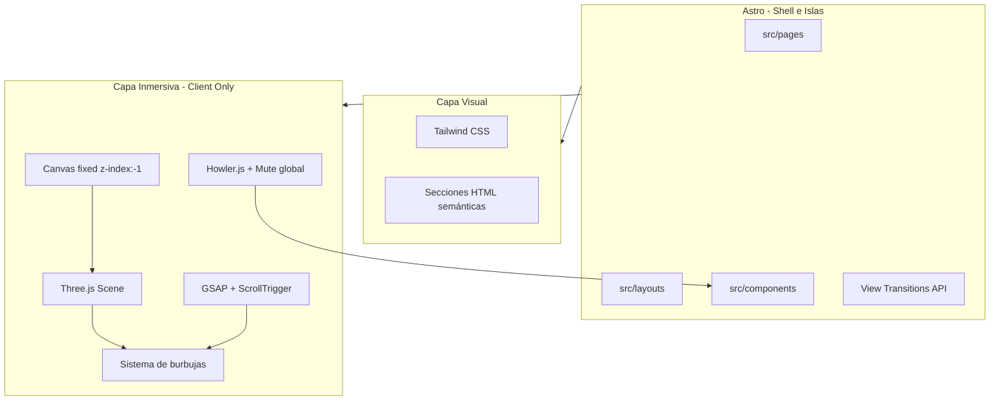

# PLANNING.md — Arquitectura Landing Inmersiva

> **Proyecto:** Light Bubbles Laundry — Lavandería local en Sevilla  
> **Concepto creativo:** "Charlie y la Fábrica de Chocolate" reinterpretada como fábrica de burbujas. Atmósfera mágica-industrial, partículas flotantes, micro-interacciones sensoriales.  
> **Documento:** Guía de referencia técnica para el desarrollo. No generar código sin consultar este archivo.

> **Empieza por §0.** Este documento conserva secciones desactualizadas de forma deliberada,
> como registro histórico. La sección **§0 Estado actual y decisiones revisadas** prevalece
> sobre todo lo que viene después.

---

## 0. Estado actual y decisiones revisadas (agosto 2026)

**Esta sección prevalece sobre el resto del documento.** Se añade de forma aditiva: las
secciones §1 a §7 se conservan sin modificar como registro del planteamiento original y del
razonamiento que lo sostenía, aunque parte de su contenido ya no describe el proyecto (ver
[`docs/DECISIONS.md`](docs/DECISIONS.md) D-014).

### 0.1 Qué queda superado

| Afirmación original | Estado real |
|---------------------|-------------|
| §1.1 — Astro versión objetivo 5.x | **Astro 7.2.2** |
| §1.1, §1.4 — GSAP + ScrollTrigger en el stack | **Nunca se instaló** |
| §1.1, §1.5 — Howler.js en el stack | **Nunca se instaló** |
| §1.1, §1.3 — Capa inmersiva 3D como capa central | **Aparcada.** Fuera de la interfaz. |
| §1.2 — `BubbleCanvas`, `MuteButton`, `ScrollAnimations` como islas activas | Ninguna está montada |
| §1.2 — View Transitions activas en `BaseLayout` | No implementado |
| §1.6 — Dependencias previstas (`@astrojs/tailwind`, `gsap`, `howler`) | No corresponden al `package.json` real |
| §2 — `tailwind.config.mjs` en la estructura | **No existe, y es correcto que no exista** |
| §2 — `src/audio/`, `src/scripts/animations/`, `src/scripts/utils/` | No existen |
| §3.1-§3.5 — Estrategia de rendimiento del canvas 3D | En pausa junto con la capa 3D |
| §4 Paso 3 — Paleta `bubble-blue` / `caramel-gold`, titular serif | Sustituida por la paleta y tipografía del design board |
| §4 Paso 3 — CTA "Reserva tu colada" | Sustituido por **"Ver tarifas"** |
| §4 Pasos 4-5 — Roadmap de GSAP y audio | No se ejecutarán en esta fase |
| §6 — PWA e i18n como fases previstas | Explícitamente fuera de alcance |

### 0.2 Stack real

| Capa | Tecnología | Versión instalada |
|------|-----------|-------------------|
| Framework | Astro | 7.2.2 |
| Estilos | Tailwind CSS | 4.3.3, vía `@tailwindcss/vite` |
| 3D (aparcado) | Three.js | 0.185.1 — instalado, sin importar en runtime |
| Tipos | TypeScript | 6.0.3 |
| Diagnósticos | `@astrojs/check` | 0.9.10 |

No hay librería de animación ni de audio. Node requerido: **>= 22.12.0**.

**Hosting (ago 2026):** previews y producción en **Vercel** (D-023). Config en
[`vercel.json`](vercel.json). El workflow de GitHub Actions sigue siendo solo CI
(`.github/workflows/ci.yml`), no despliega.

### 0.3 Tailwind v4 se configura en CSS

Tailwind v4 se integra como plugin de Vite y se configura mediante el bloque `@theme` dentro
de [`src/styles/global.css`](src/styles/global.css). **No existe `tailwind.config.mjs` y no
debe crearse**; la referencia a ese archivo en el árbol de §2 corresponde al modelo de
Tailwind v3 y ya no aplica. Ver [`docs/DECISIONS.md`](docs/DECISIONS.md) D-013.

Los tokens actuales de `global.css` (`--font-display: Georgia serif`, `bubble-blue`,
`caramel-gold`, `foam-white`) contradicen el design board y se migran como primera tarea de
[`SPEC-001`](docs/specs/001-home.md).

### 0.4 La capa 3D queda aparcada, no eliminada

Se construyó la escena Three.js y después se retiró de la interfaz por no encajar con la
dirección visual. Los archivos **se conservan dormidos**:

```
src/scripts/3d/
├── scene.ts           # Init renderer, cámara, loop rAF
├── bubbles.ts         # Sistema de partículas
├── laundryRoom.ts     # Escena de la sala, animación de puerta y tambor
├── modelLoader.ts     # Carga GLTF
└── performance.ts     # Detección de tier de dispositivo
src/components/canvas/
└── BubbleCanvas.astro # Isla, sin importar desde ningún sitio
```

`BaseLayout.astro` ya no contiene `#bubble-canvas`. Nada importa estos módulos, por lo que no
entran en el bundle de producción.

**No los elimines.** Están aparcados a propósito y la decisión es reversible mediante una
SPEC. Ver [`docs/DECISIONS.md`](docs/DECISIONS.md) D-003.

Las burbujas del MVP son **decoración ligera en CSS/SVG**, no partículas WebGL. Sus límites
están en [`docs/DESIGN_SYSTEM.md`](docs/DESIGN_SYSTEM.md) — Bubbles.

### 0.5 Dirección de producto y diseño vigente

El concepto original ("Charlie y la Fábrica de Chocolate", atmósfera mágica-industrial,
micro-interacciones sensoriales con audio) queda sustituido por una dirección **light-first**:
luminosa, limpia, cercana y mediterránea, con fondo fotográfico o lavados de color en lugar
de escena 3D.

La documentación de producto y diseño vive ahora en [`docs/`](docs/):

| Documento | Responsabilidad |
|-----------|-----------------|
| [`docs/PRODUCT.md`](docs/PRODUCT.md) | Qué construimos y para quién |
| [`docs/VISUAL_DIRECTION.md`](docs/VISUAL_DIRECTION.md) | Cómo debe verse y sentirse |
| [`docs/DESIGN_SYSTEM.md`](docs/DESIGN_SYSTEM.md) | Tokens y reglas visuales reutilizables |
| [`docs/DECISIONS.md`](docs/DECISIONS.md) | Decisiones tomadas y su motivo |
| [`docs/specs/`](docs/specs/) | Qué implementar en cada tarea |
| [`AGENTS.md`](AGENTS.md) | Cómo debe trabajar el agente |

Este documento (`PLANNING.md`) sigue siendo la referencia de **arquitectura técnica,
estructura y objetivos de rendimiento**.

### 0.6 Lo que sigue vigente

- **§2 Convenciones de código:** TypeScript en `src/scripts/`, PascalCase en componentes Astro, kebab-case en IDs y clases, estado global mínimo, sin Zustand/Pinia/Redux.
- **§3.2 Tiers de dispositivo:** los umbrales (mobile ≤768px, tablet ≤1024px, desktop >1024px) se reutilizan como breakpoints de diseño.
- **§3.6 Métricas objetivo:** LCP, TBT y CLS siguen siendo los objetivos. Los objetivos de FPS quedan en pausa junto con la capa 3D.
- **§5 Accesibilidad:** vigente y ampliado en [`docs/DESIGN_SYSTEM.md`](docs/DESIGN_SYSTEM.md) — Contrast rules.
- **§7 Notas para el equipo:** vigente, con la salvedad de que las desviaciones de stack se registran ahora en [`docs/DECISIONS.md`](docs/DECISIONS.md).
- Salida **estática (SSG)**, sin backend, sin base de datos y sin autenticación.

### 0.7 Verificación

```bash
npm run check   # astro check: tipos y diagnósticos
npm run build   # build de producción
```

Son los dos comandos que ejecuta CI. **No existe** `npm run astro check`.

---

## 1. Stack Técnico y Arquitectura

### 1.1 Visión general de capas

La aplicación se organiza en tres capas independientes que se componen en el layout base:



| Capa | Tecnología | Versión objetivo | Rol |
|------|-----------|------------------|-----|
| Framework | Astro | 5.x | SSG, Arquitectura de Islas, View Transitions |
| Estilos | Tailwind CSS | 4.x | Utility-first, diseño responsive mobile-first |
| 3D / Canvas | Three.js | latest stable | Escena de fondo en canvas global fixed |
| Animaciones | GSAP + ScrollTrigger | GSAP 3.x | Animaciones de entrada y scroll-driven |
| Audio | Howler.js | latest stable | SFX micro-interactivos con estado Mute global |

### 1.2 Framework principal: Astro

**Arquitectura de Islas:** Astro renderiza la mayor parte del HTML como contenido estático en build time. Solo los componentes que requieren interactividad del cliente se hidratan como "islas" independientes, minimizando el JavaScript enviado al navegador.

**Componentes estáticos** (HTML puro Astro + Tailwind, sin directiva client):
- `Hero.astro`, `Services.astro`, `Contact.astro`
- `Button.astro` (si no requiere lógica JS)
- Estructura semántica de `<header>`, `<main>`, `<footer>`

**Componentes interactivos** (islas con hidratación):
| Componente | Directiva | Responsabilidad |
|-----------|-----------|-----------------|
| `BubbleCanvas.astro` | `client:load` | Inicializa Three.js, monta el loop de renderizado |
| `MuteButton.astro` | `client:load` | Toggle global de audio, persiste en localStorage |
| `ScrollAnimations.astro` | `client:visible` | Registra ScrollTriggers solo cuando entra en viewport |

**View Transitions:** Activar en `src/layouts/BaseLayout.astro` mediante el componente `<ViewTransitions />` de `astro:transitions`. Esto habilita transiciones suaves entre rutas futuras (`/`, `/servicios`, `/contacto`) sin recarga completa de la escena 3D si se mantiene el canvas en el layout persistente.

```astro
---
// src/layouts/BaseLayout.astro (referencia futura)
import { ViewTransitions } from 'astro:transitions';
---
<html lang="es">
  <head>
    <ViewTransitions />
  </head>
  <body>
    <canvas id="bubble-canvas" aria-hidden="true"></canvas>
    <slot />
  </body>
</html>
```

### 1.3 Canvas global de fondo (Three.js)

El canvas WebGL vive **fuera del flujo del documento**, como capa decorativa:

```css
#bubble-canvas {
  position: fixed;
  inset: 0;
  width: 100%;
  height: 100%;
  z-index: -1;
  pointer-events: none;
}
```

- `pointer-events: none` evita que el canvas intercepte clicks del DOM.
- La posición del cursor se lee via `window.addEventListener('mousemove', ...)` en `bubbles.ts`.
- El renderer usa `{ alpha: true }` para fondo transparente; el color de fondo lo define Tailwind en `<body>`.

### 1.4 Animaciones: GSAP + ScrollTrigger

GSAP gestiona dos tipos de animación:
1. **On load:** fade-in del Hero, stagger de titulares.
2. **On scroll:** modificación de uniforms de la escena 3D (`bubbleSpeed`, `bubbleTurbulence`) mediante callbacks de ScrollTrigger.

Regla: un ScrollTrigger por sección, nunca uno por partícula.

### 1.5 Audio: Howler.js

`audioManager.ts` es un singleton que centraliza:
- Estado `isMuted` (persistido en `localStorage` bajo clave `lb-mute`)
- Desbloqueo del contexto de audio tras el primer gesto del usuario (click/touch)
- Mapa de IDs de sonido → archivos en `public/audio/`

No autoplay con sonido. El botón Mute es accesible (`aria-pressed`, `aria-label="Activar/desactivar sonido"`).

### 1.6 Dependencias npm previstas

```json
{
  "dependencies": {
    "astro": "^5",
    "@astrojs/tailwind": "^6",
    "tailwindcss": "^4",
    "three": "^0.170",
    "gsap": "^3.12",
    "howler": "^2.2"
  },
  "devDependencies": {
    "@types/three": "^0.170",
    "typescript": "^5"
  }
}
```

---

## 2. Estructura de Carpetas Propuesta

```
light_bubbles_laundry/
├── PLANNING.md                     # Este documento
├── astro.config.mjs
├── tailwind.config.mjs
├── tsconfig.json
├── package.json
├── public/
│   ├── audio/
│   │   ├── bubble-pop.mp3
│   │   ├── scroll-whoosh.mp3
│   │   └── cta-click.mp3
│   └── favicon.svg
└── src/
    ├── pages/
    │   └── index.astro             # Landing principal
    ├── layouts/
    │   └── BaseLayout.astro        # HTML shell + canvas + ViewTransitions
    ├── components/
    │   ├── ui/
    │   │   ├── MuteButton.astro    # Isla client:load
    │   │   └── Button.astro
    │   ├── sections/
    │   │   ├── Hero.astro
    │   │   ├── Services.astro
    │   │   └── Contact.astro
    │   └── canvas/
    │       └── BubbleCanvas.astro  # Isla client:load — entry point Three.js
    ├── scripts/
    │   ├── 3d/
    │   │   ├── scene.ts            # Init renderer, camera, rAF loop
    │   │   ├── bubbles.ts          # Particle system + cursor interaction
    │   │   └── performance.ts      # Device tier detection, particle limits
    │   ├── animations/
    │   │   └── scroll.ts           # GSAP ScrollTrigger setup
    │   └── utils/
    │       └── resize.ts           # Debounced resize handler
    ├── audio/
    │   ├── audioManager.ts         # Howler singleton + mute state
    │   └── sounds.ts               # Mapa de IDs → rutas de archivos
    └── styles/
        └── global.css              # @tailwind directives + estilos base del canvas
```

### Convenciones de código

- **TypeScript puro** en `src/scripts/` y `src/audio/`. Importado desde islas Astro via `<script>` inline o `import` en bloque frontmatter con `client:load`.
- **Estado global mínimo:** solo `audioManager` (mute) y referencia exportada `bubbleScene` como singleton. Sin Zustand, Pinia ni Redux en fase 1.
- **Assets estáticos** (audio, imágenes) en `public/`. Texturas Three.js opcionales en `public/textures/`.
- **Naming:** camelCase para funciones/variables TS, PascalCase para componentes Astro, kebab-case para IDs HTML y clases utilitarias Tailwind.

---

## 3. Estrategia de Rendimiento y Ahorro de Recursos (60 FPS)

Objetivo: mantener 60 FPS en desktop y ≥ 30 FPS estables en móvil mid-range.

### 3.1 Bucle de renderizado

Un único loop `requestAnimationFrame` en `scene.ts`:

```typescript
// Patrón de referencia — scene.ts
let animationId: number;
let isRunning = true;

function animate() {
  if (!isRunning) return;
  animationId = requestAnimationFrame(animate);
  updateBubbles(deltaTime);
  renderer.render(scene, camera);
}

// Pausar cuando la pestaña no es visible
document.addEventListener('visibilitychange', () => {
  isRunning = !document.hidden;
  if (isRunning) animate();
  else cancelAnimationFrame(animationId);
});
```

**Pautas del loop:**
- Calcular `deltaTime` con `clock.getDelta()` de Three.js para movimiento frame-independent.
- No usar Web Workers para Three.js en v1 (complejidad de transferencia de ArrayBuffers). Optimizar en hilo principal con límites de partículas.
- Cap de pixel ratio: `renderer.setPixelRatio(Math.min(window.devicePixelRatio, dprCap))`.

### 3.2 Tiers de dispositivo

Detectados en `performance.ts` al init. Combinan viewport width y señales de hardware:

| Tier | Condición | Partículas máx. | DPR cap | Notas |
|------|-----------|-----------------|---------|-------|
| `mobile` | `max-width: 768px` OR `hardwareConcurrency <= 4` | 80–120 | 1.5 | Reducir size de partículas |
| `tablet` | 769px – 1024px | 200–300 | 2.0 | — |
| `desktop` | > 1024px | 400–600 | 2.0 | Full experience |

```typescript
// Patrón de referencia — performance.ts
export function getDeviceTier(): 'mobile' | 'tablet' | 'desktop' {
  const w = window.innerWidth;
  const cores = navigator.hardwareConcurrency ?? 4;
  if (w <= 768 || cores <= 4) return 'mobile';
  if (w <= 1024) return 'tablet';
  return 'desktop';
}

export const PARTICLE_LIMITS = {
  mobile: 100,
  tablet: 250,
  desktop: 500,
} as const;
```

Si `prefers-reduced-motion: reduce` está activo, forzar tier `mobile` y desactivar interacción cursor.

### 3.3 Manejo de resize

Implementado en `src/scripts/utils/resize.ts`:

- Debounce de **150 ms** sobre el evento `resize`.
- En cada resize validado:
  1. `camera.aspect = window.innerWidth / window.innerHeight`
  2. `camera.updateProjectionMatrix()`
  3. `renderer.setSize(w, h)`
  4. Re-evaluar tier de dispositivo; ajustar conteo de partículas si cambió (sin recrear geometría).
- **No recrear** `BufferGeometry` en cada resize; solo actualizar uniforms o reutilizar pool de partículas.

### 3.4 ScrollTrigger + Three.js

Sincronización via callback global, no por partícula:

```typescript
// Patrón de referencia — scroll.ts
ScrollTrigger.create({
  trigger: 'main',
  start: 'top top',
  end: 'bottom bottom',
  scrub: true,
  onUpdate: (self) => {
    bubbleScene.setScrollProgress(self.progress);
    // progress 0→1 modifica bubbleSpeed y bubbleTurbulence
  },
});
```

### 3.5 Carga diferida de bundles pesados

Dentro de `BubbleCanvas.astro`, cargar módulos con dynamic import:

```typescript
const [{ initScene }, { initScrollAnimations }] = await Promise.all([
  import('../../scripts/3d/scene'),
  import('../../scripts/animations/scroll'),
]);
```

- Three.js, GSAP y Howler no se incluyen en el bundle estático de Astro.
- Desactivar prefetch de Astro para scripts > 50 KB.

### 3.6 Métricas objetivo (Lighthouse)

| Métrica | Objetivo MVP | Objetivo final |
|---------|-------------|----------------|
| LCP | < 2.5 s | < 1.8 s |
| TBT | < 200 ms | < 100 ms |
| CLS | < 0.1 | < 0.05 |
| FPS (desktop) | ≥ 55 | 60 |
| FPS (mobile) | ≥ 28 | ≥ 30 |

---

## 4. Roadmap de Implementación

### Paso 1 — Scaffold Astro + Tailwind + Canvas de fondo

**Objetivo:** Proyecto funcional con canvas fixed visible y layout base.

**Tareas:**
1. `npm create astro@latest . -- --template minimal --typescript strict`
2. `npx astro add tailwind`
3. Crear `src/layouts/BaseLayout.astro`:
   - `<ViewTransitions />` en `<head>`
   - `<canvas id="bubble-canvas" aria-hidden="true">` antes del `<slot />`
   - Import de `global.css`
4. Crear `src/pages/index.astro` usando `BaseLayout`
5. Estilos base en `global.css` (canvas fixed, tipografía, colores de marca)
6. Verificar: canvas ocupa viewport completo, DOM es interactivo encima del canvas

**Criterio de done:** `npm run dev` muestra página con canvas de fondo vacío y layout responsive.

---

### Paso 2 — Escena Three.js + Sistema de partículas interactivas

**Objetivo:** Burbujas flotantes reactivas al cursor.

**Tareas:**
1. `npm install three` + `npm install -D @types/three`
2. Implementar `src/scripts/3d/scene.ts`:
   - `PerspectiveCamera(75, aspect, 0.1, 1000)`
   - `WebGLRenderer({ canvas, alpha: true, antialias: true })`
   - rAF loop con Page Visibility API
3. Implementar `src/scripts/3d/bubbles.ts`:
   - `BufferGeometry` con atributos `position`, `velocity`, `size`
   - Material: `PointsMaterial` con `sizeAttenuation: true`, color blanco semitransparente
   - Update loop: flotación sinusoidal + movimiento ascendente continuo
4. Interacción cursor:
   - Normalizar mouse a NDC (-1 a 1)
   - Partículas dentro de radio R del cursor reciben impulso radial suave
   - Decaimiento exponencial del impulso (evita acumulación infinita)
5. Implementar `src/scripts/3d/performance.ts` e integrar límites desde el init
6. Crear `src/components/canvas/BubbleCanvas.astro` con `client:load`

**Criterio de done:** Burbujas flotan a 60 FPS en desktop; cursor las empuja suavemente; tier mobile activo en viewport ≤ 768px.

---

### Paso 3 — Hero y estructura HTML visual (Tailwind)

**Objetivo:** Contenido de marca visible sobre la escena 3D.

**Tareas:**
1. Crear `src/components/sections/Hero.astro`:
   - Titular principal (nombre de la lavandería)
   - Subtítulo con referencia a Sevilla / fábrica de burbujas
   - CTA primario ("Reserva tu colada")
2. Crear `Services.astro` y `Contact.astro` como secciones placeholder
3. Definir paleta Tailwind en `tailwind.config.mjs`:
   - `bubble-blue`: azules agua (#4FC3F7 → #0288D1)
   - `foam-white`: blancos espumosos (#FAFAFA)
   - `caramel-gold`: acentos dorados (#FFB74D → #F57C00)
4. Tipografía: display serif o rounded sans para titulares; sans-serif legible para cuerpo
5. Layout mobile-first con breakpoints `sm`, `md`, `lg`
6. HTML semántico: `<header>`, `<main>`, `<section aria-labelledby="...">`, `<footer>`

**Criterio de done:** Landing legible, responsive, contraste WCAG AA en textos principales.

---

### Paso 4 — Integración GSAP + ScrollTrigger

**Objetivo:** Animaciones de entrada y aceleración de burbujas al scroll.

**Tareas:**
1. `npm install gsap`
2. Implementar `src/scripts/animations/scroll.ts`:
   - `gsap.registerPlugin(ScrollTrigger)`
   - Animación Hero on load: `gsap.from('.hero-title', { opacity: 0, y: 40, stagger: 0.15 })`
   - Scroll global: mapear `scrollProgress` → `{ bubbleSpeed, bubbleTurbulence }`
   - Sección Servicios: parallax sutil en offset Y (opcional pin)
3. Crear `ScrollAnimations.astro` con `client:visible`
4. Respetar `prefers-reduced-motion`:
   ```typescript
   const prefersReduced = window.matchMedia('(prefers-reduced-motion: reduce)').matches;
   if (prefersReduced) {
     ScrollTrigger.killAll();
     bubbleScene.setReducedMotion(true);
   }
   ```

**Criterio de done:** Al hacer scroll, las burbujas aceleran visiblemente; Hero aparece con stagger; reduced-motion desactiva animaciones.

---

### Paso 5 — Audio micro-interactivo (Howler.js) + Botón Mute

**Objetivo:** Feedback sonoro sutil con control global de silencio.

**Tareas:**
1. `npm install howler` + `npm install -D @types/howler`
2. Añadir archivos SFX en `public/audio/` (formato .mp3 + fallback .ogg)
3. Implementar `src/audio/sounds.ts`:
   ```typescript
   export const SOUNDS = {
     bubblePop: '/audio/bubble-pop.mp3',
     scrollWhoosh: '/audio/scroll-whoosh.mp3',
     ctaClick: '/audio/cta-click.mp3',
   } as const;
   ```
4. Implementar `src/audio/audioManager.ts`:
   - Singleton con métodos `play(id)`, `toggleMute()`, `unlock()`
   - Persistir `isMuted` en `localStorage`
   - Lazy init de Howl instances
5. Integrar triggers:
   - Hover en burbujas (throttled, max 1 pop cada 300 ms)
   - Scroll (whoosh suave en cambio de sección, no continuo)
   - Click en CTA
6. Crear `src/components/ui/MuteButton.astro`:
   - Fixed bottom-right, icono speaker/speaker-off
   - `aria-pressed={isMuted}`, `aria-label="Activar/desactivar sonido"`

**Criterio de done:** Sonidos funcionan tras primer click; mute persiste entre recargas; sin autoplay no solicitado.

---

## 5. Accesibilidad

| Requisito | Implementación |
|-----------|---------------|
| Canvas decorativo | `aria-hidden="true"` en `#bubble-canvas` |
| Reduced motion | Desactivar ScrollTrigger, reducir partículas, sin SFX auto |
| Contraste | WCAG AA mínimo (4.5:1) en textos sobre fondo |
| Mute button | `aria-pressed`, focus visible, operable con teclado |
| Semántica | Landmarks HTML5, headings en orden jerárquico |
| Skip link | "Saltar al contenido" como primer elemento focusable |

---

## 6. Próximas fases (post-MVP)

- **Fase 2:** Página `/servicios` con View Transitions; formulario de contacto funcional
- **Fase 3:** SEO (meta tags, Open Graph, sitemap), schema.org LocalBusiness
- **Fase 4:** Optimización Lighthouse > 90 en todas las categorías
- **Fase 5:** PWA básica (offline shell, iconos), i18n ES/EN si aplica

---

## 7. Notas para el equipo

- Consultar este documento antes de añadir dependencias o cambiar la estructura de carpetas.
- Priorizar simplicidad: una geometría, un material, un loop, un ScrollTrigger global.
- Cualquier desviación del stack (React, Vue, otras libs 3D) requiere actualizar este archivo primero.
- Commits atómicos por paso del roadmap para facilitar revisión y rollback.

---

*Última actualización: agosto 2026*
